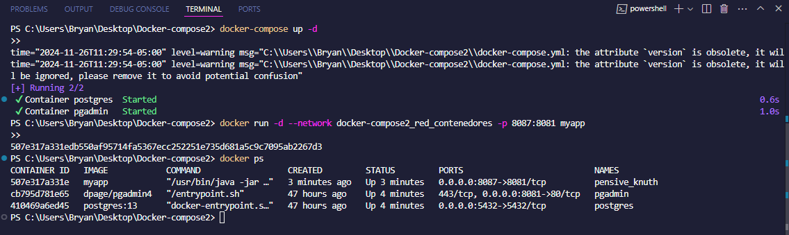
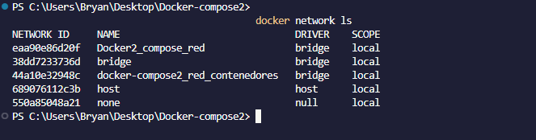
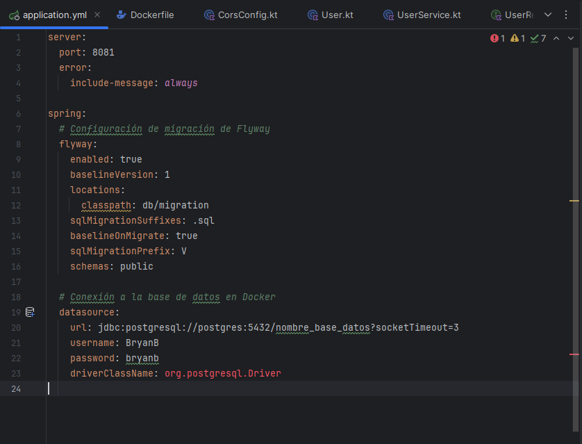
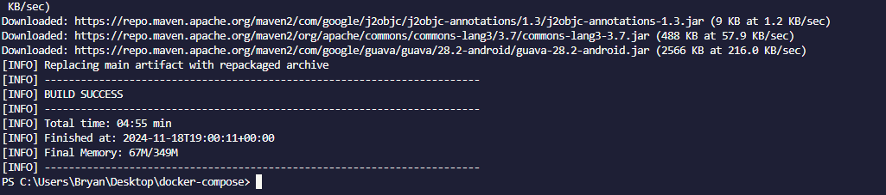
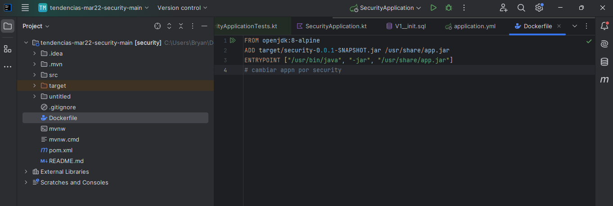
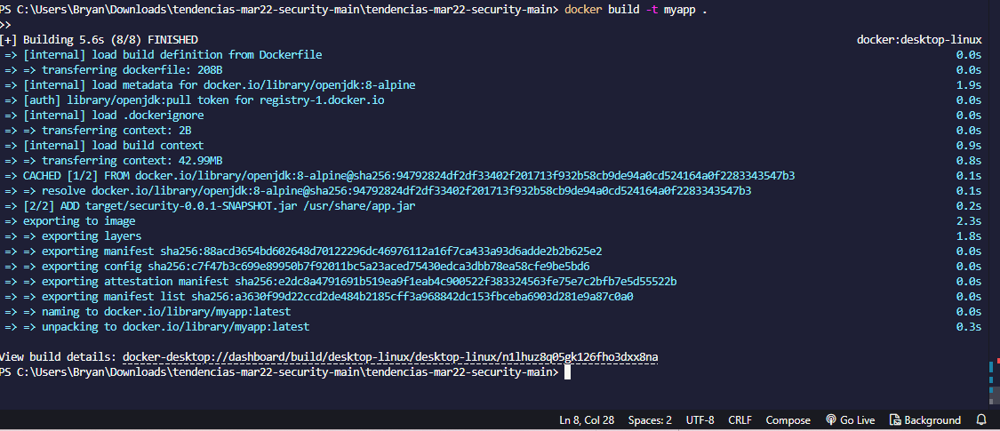
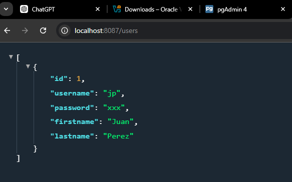

# Despliegue postgres y spring boot con YML.

## 1. Titulo.

Hacemos referencia a la implementacion de una BD Postgres ya con una aplicacion desarrollada en Spring Boot
para un entorno de produccion o deasarrollo.

## 2. Tiempo de duración.

Este proyecto me llevo casi 1 semana

## 3. Fundamentos.

 Por problemas de actualización de IntelliJ IDEA 2024.3 con esta versión puede implementar el siguiente proyecto la cualme sirvio para ejecutar contenedores de la BD (postgersql y pgadmin) crear una imagen a mi maquina local crearcion de una red y la creacion de ia base de datos para el proyecto.
 Docker es una herramienta diseñada para virtualizar y empaquetar aplicaciones junto con sus dependencias en contenedores. A diferencia de las máquinas virtuales, estos contenedores comparten el núcleo del sistema operativo, lo que los hace más ligeros y eficientes.

Imagen: Una imagen es un conjunto de instrucciones que define cómo debe configurarse un contenedor.

## 3.2 Spring Boot.

Spring Boot es un framework basado en Spring que busca simplificar el proceso de configuración y despliegue de aplicaciones en Java. Esto se logra mediante el uso de dependencias preconfiguradas y una estructura estándar.

## 3.3 YAML.

YAML es un estándar que facilita la configuración de aplicaciones al usar un formato simple, intuitivo y fácil de leer tanto para personas como para máquinas.

## 4. Conocimientos previos.

Para realizar la práctica de despliegue de una base de datos PostgreSQL junto con una aplicación Spring Boot, es necesario tener conocimientos previos en las siguientes áreas.
Es fundamental comprender los conceptos básicos de Docker, una plataforma que permite la creación, despliegue y ejecución de aplicaciones dentro de contenedores. Los contenedores son entornos aislados que empaquetan todo lo necesario para ejecutar una aplicación, como código, dependencias y configuraciones, garantizando que la aplicación se ejecute de manera consistente en cualquier entorno. En este proyecto, se utilizaron contenedores para desplegar tanto la base de datos PostgreSQL como la aplicación Spring Boot.

Uso básico de Docker.
Tener Docker instalado previamente.
Manejo de la terminal.
Acceso a un navegador web.
Conexión a Internet.
Comprensión de cómo funcionan los puertos.
Lectura de documentación de Docker.

## 5. Objetivos a alcanzar.

Los objetivos a alcanzar en un proyecto de despliegue de PostgreSQL y Spring Boot pueden dividirse en varios aspectos clave, que incluyen tanto la configuración adecuada como la integración entre ambos sistemas. Aquí te dejo una lista de objetivos generales y específicos que deberían cumplirse.

## 6. Equipo necesario.

El servidor de base de datos utilizado es PostgreSQL
Un sistema de gestión de bases de datos relacional y de código abierto que se encarga de almacenar y gestionar los datos de la aplicación de manera eficiente. 
Para el desarrollo de la aplicación, se utilizan IDEs como IntelliJ IDEA o Visual Studio Code, que son entornos integrados para escribir, depurar y gestionar el código de la aplicación Spring Boot.

Computadora.
Navegador web.
Docker instalado y funcionando.
Proyecto configurado en Spring Boot.

## 7. Material de apoyo.

Documentación oficial de Docker.
Guía de la asignatura.
Imágenes de Docker necesarias para el proyecto.
Proyecto previamente creado.

## 8. Procedimiento.

Se creó una red personalizada para que los contenedores puedan comunicarse entre sí.
Se levantó un contenedor para PostgreSQL, configurando un usuario, contraseña y base de datos, y se conectó a la red personalizada.
Se desplegó un contenedor para pgAdmin, asignando credenciales de acceso y conectándolo a la misma red.
Se ejecutó un contenedor con la aplicación Spring Boot, conectándolo a la red personalizada y asignándole un puerto específico para el acceso.
Se verificó que todos los contenedores estuvieran corriendo correctamente mediante un listado de contenedores activos.
Se comprobó la conectividad entre los contenedores dentro de la red personalizada, utilizando sus nombres como referencia para la comunicación interna.

 
 

 ## 9. Creacion del artefacto Jar.

 Configura el archivo application.yml con la conexión a la base de datos y las migraciones, añade las dependencias necesarias, compila el proyecto y genera el JAR con mvn package o gradle build. Verifica que funcione correctamente aplicando las migraciones y despliega el artefacto.

 

 
  
  

 ## 10. Vamos a crear la imagen con Springboot.

 Ahora con el archivo jar que contiene los documentos del proyecto vamos a colocarlo dentro de una imagen de docke para poder tener una mejor ejecución del proyecto.

 .

 ## 11. Creacion de un nuevo contenedor o ultimo contenedor.

 vamos a hacer un entorno aislado la cual nos ayudara a poder tener nuestro proyecto en springBoot para poder crear un nuevo contenedor que vamoa a tener una imagen dentro de el con el poryecto completo con el rchivo.jar.
 

 ## 12. Mostar el Backend el nuestro servidor.

 Una vez terminado de crar el ultimo contnedor ejecutamos el siguiente comando que veremos en la imagen despues vamos y ponemos localhost:8083/users.

 

 